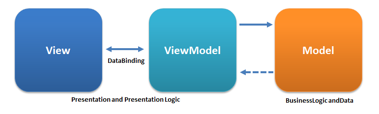

[![Contributors][contributors-shield]][contributors-url]
[![Forks][forks-shield]][forks-url]
[![Stargazers][stars-shield]][stars-url]
[![Issues][issues-shield]][issues-url]
[![MIT License][license-shield]][license-url]
[![LinkedIn][linkedin-shield]][linkedin-url]

# ModularizeAppAndroid

<!-- PROJECT LOGO -->
 

  

  <h3 align="center">MeReal Concept- Modular Android App</h3>

  

    Android Application Experimentation, for making a complexe App ;) !
     
    <a href="https://github.com/MeReal-Project/ModularizeAppAndroid"><strong>Explore the project »</strong></a>
     
    ·
    <a href="https://github.com/MeReal-Project/ModularizeAppAndroid/issues">Report Bug</a>
    ·
    <a href="https://github.com/MeReal-Project/ModularizeAppAndroid/issues">Request Feature</a>
  

<!-- TABLE OF CONTENTS -->

  
Table of Contents

  <ol>
    <li>
      <a href="#about-the-project">About The Project</a>
      <ul>
        <li><a href="#built-with">Built With</a></li>
      </ul>
    </li>
    <li><a href="#project-structure">Project Structure</a></li>
    <li><a href="#roadmap">Roadmap</a></li>
    <li><a href="#clean-architecture">Clean Architecture</a></li>
    <li>
      <a href="#multi-module-architecture">Multi-Module Architecture</a>
      <ul>     
        <li><a href="#advantagedisavantage">Advantage/Disavantage</a></li>
        <li>
          <a href="#modularization-strategy">Modularization Strategy</a>
          <ul>
            <li><a href="#layer-modularization">Layer Modularization</a></li>
            <li><a href="#feature-modularization">Feature Modularization</a></li>
            <li><a href="#layered-feature-modularization">Layered-Feature Modularization</a></li>
          </ul>
        </li>
      </ul>
    </li>
    <li><a href="#mvvm">MVVM</a></li>
    <li><a href="#contact">Contact</a></li>
  </ol>

<!-- ABOUT THE PROJECT -->
## About The Project

This Project follow a course I have do about Modularization with Jetpack Compose, the goal is to have a better understanding about modularization for Android Application.

Here's why:
* Personnal Purpose have a solid architecture for a big and complex android app
* You will learn the different type of Modularization
* You should to apply clean architecture method :smile:

Follow Dardev12, for more project

Fork It if you want to try this project. 

(<a href="#top">back to top</a>)

### Built With

This section summarize the library and Framework i have use for this project. 

* [Kotlin](https://kotlinlang.org/)
* [JetpackCompose](https://developer.android.com/jetpack/compose)
* [Dagger/Hilt](https://dagger.dev/hilt/)
* [Retrofit](https://square.github.io/retrofit/)
* [Coil](https://coil-kt.github.io/coil/)
* [Coroutine](https://kotlinlang.org/docs/coroutines-overview.html#sample-projects)
* [Room](https://developer.android.com/jetpack/androidx/releases/room?gclid=CjwKCAiAyPyQBhB6EiwAFUuakjQO6IsuMr2gvRX9ucrl7CsuXX68HNYztT_4OVJ1DL37qsuibNdqqBoCIhMQAvD_BwE&gclsrc=aw.ds)

(<a href="#top">back to top</a>)

## Project Structure

The Structure of each module in the Project. 

    .
    ├── buildSrc                   # Compiled files (alternatively `dist`)
    ├── app
    │   ├── ui
    │   |  └── theme
    │   ├── di
    │   └── navigation
    ├── core
    │   ├── data
    │   |  └── preferences
    │   ├── domain
    │   └── util
    ├── core-ui
    ├── onboarding                     # Source files (alternatively `lib` or `app`)
    │   ├── onboarding_domain
    │   |  ├── di
    │   |  └── use_case
    │   └── onboarding_presentation
    │       ├── activity
    │       ├── age
    │       ├── components
    │       ├── gender
    │       ├── goal
    │       ├── height
    │       ├── nutrient_goal
    │       ├── weight
    │       └── welcome
    └──  tracker                   # Test files (alternatively `spec` or `tests`)
       ├── tracker_data          # Load and stress tests
       │    ├── di
       │    ├── local
       │    |  └── entity
       │    ├── mapper
       │    ├── remote
       │    |  └── dto
       │    └── repository
       ├── tracker_domain          # End-to-end, integration tests (alternatively `e2e`)
       │    ├── di
       │    ├── model
       │    ├── repository
       │    └── use_case
       └── tracker_presentation                # Unit tests
            ├── components
            ├── search
            |   └──  components
            └── tracker_overview
                └──  components
    

<!-- ROADMAP -->
## Roadmap

- [x] Multi-Module(Style Layered-Feature Modularization)
- [x] Migration Kotlin DSL
- [x] Connection with OpenFood Api [OpenFood]https://ca.openfoodfacts.org/
- [x] Add "components" document to easily copy & paste sections of the readme
- [x] End to End Test for Ui
- [x] Unit Test(learn how to Mock)
- [x] Overview Flow
- [ ] TrackerFood Flow
    - [ ] TrackerOverview Screen
       - [x] UI
       - [x] ViewModel,State
       - [ ] "Bug to fix" Don't display food item,carbs,calories and fat data on the screen
   - [ ] Search Screen
       - [x] UI
       - [x] ViewModel,State
       - [ ] "Bug to fix" Cannot display the textfield when we click on the food item    
- [ ] Multi-language Support
    - [ ] French
    - [x] English

(<a href="#top">back to top</a>)

<!-- USAGE EXAMPLES -->
## Clean Architecture

Why is good to use the clean architecture concept:
1. Well-scaling apps
2. Easily testable
3. Quickly understandable for others

We need to split the base code in 3 layer(presentation,domain,data):
- Data Layer is for Database Implementation,Remote API, Mappers for DB entities and DTO(Data Transfert Object)
- Domain Layer is for UseCase(Business logic and it allow us to avoid ViewModels to being too big)
- Presentation Layer is for UI(Composable) and ViewModels

(<a href="#top">back to top</a>)

## Multi-Module Architecture

Allow us to split the application into each module and it is very benefit for complex Application to adopt that. 

### Advantage/Disavantage

Advantage of Multi-Module:
  - Clear separation
  - Faster Gradle builds
  - dynamic feature and support for instant apps
  - Part of application are reusable
Disavantage of Multi-Module:
  - Lots of initial setup involved(build.gradle everywhere 😈)

## Modularization Strategy

It is very important to know what kind of Modularization strategy to adopt when we create an application and we are 3 options to choose

### Layer Modularization

Layer Strategy is refer to the 3 layer(Data,Domain,Presentation)
  - Big Modules => Slow Build
  - Not reusable
  - Hard to work in an isolated environement 

### Feature Modularization

Feature Strategy is refer to a single feature is the application we want to develop( exemple: DeliveryApp => Feature for Order/Feature for DashBoard User/...)
  - 1 module per feature
  - Reusable Modules
  - Limited Size 
  - Work better in isolated environement
  - No clear separation

### Layered-Feature Modularization

Layered-Feature Strategy is a mix between Feature and Layer Strategy to get the benefit for each of this strategy
  - Module by feature with layer sub-modules(ex: ShoppingData / ShoppingDomain / ShoppingPresentation)

The Stategy Who have been use in this repository is the Layered-Feature Modularization.

_For more Multi-Module examples, please refer to the [Medium Article](https://proandroiddev.com/modularization-in-android-architecture-point-of-view-from-a-to-z-part-ii-8baea5b2e4fd)_

(<a href="#top">back to top</a>)

## MVVM

- Model:
    1. Contains busniss logic
    2. Contains Data source
- View:
    1. Binding with ViewModel
    2. UI(Compose)
    3. Inform the ViewModel about User Interactions
- ViewModel:
    1. Expose Data to the View
    2. ViewModel is the link between the Model and the View.

_For more examples, please refer to the [Documentation](https://example.com)_

(<a href="#top">back to top</a>)

<!-- CONTACT -->
## Contact

Darren Lambert - Dardevpro@outlook.com

Project Link: [https://github.com/MeReal-Project/ModularizeAppAndroid](https://github.com/MeReal-Project/ModularizeAppAndroid)

(<a href="#top">back to top</a>)

[Best-README-Template](https://github.com/othneildrew/Best-README-Template)

<!-- MARKDOWN LINKS & IMAGES -->
<!-- https://www.markdownguide.org/basic-syntax/#reference-style-links -->
[contributors-shield]: https://img.shields.io/github/contributors/MeReal-Project/ModularizeAppAndroid.svg?style=for-the-badge
[contributors-url]: https://github.com/MeReal-Project/ModularizeAppAndroid/graphs/contributors
[forks-shield]: https://img.shields.io/github/forks/MeReal-Project/ModularizeAppAndroid.svg?style=for-the-badge
[forks-url]: https://github.com/MeReal-Project/ModularizeAppAndroid/network/members
[stars-shield]: https://img.shields.io/github/stars/MeReal-Project/ModularizeAppAndroid.svg?style=for-the-badge
[stars-url]: https://github.com/MeReal-Project/ModularizeAppAndroid/stargazers
[issues-shield]: https://img.shields.io/github/issues/MeReal-Project/ModularizeAppAndroid.svg?style=for-the-badge
[issues-url]: https://github.com/MeReal-Project/ModularizeAppAndroid/issues
[license-shield]: https://img.shields.io/github/license/MeReal-Project/ModularizeAppAndroid.svg?style=for-the-badge
[license-url]: https://github.com/MeReal-Project/ModularizeAppAndroid/blob/master/LICENSE.txt
[linkedin-shield]: https://img.shields.io/badge/-LinkedIn-black.svg?style=for-the-badge&logo=linkedin&colorB=555
[linkedin-url]: https://linkedin.com/in/linkedin_username
<!--[product-screenshot]: Image/Logo MeReal.png-->
